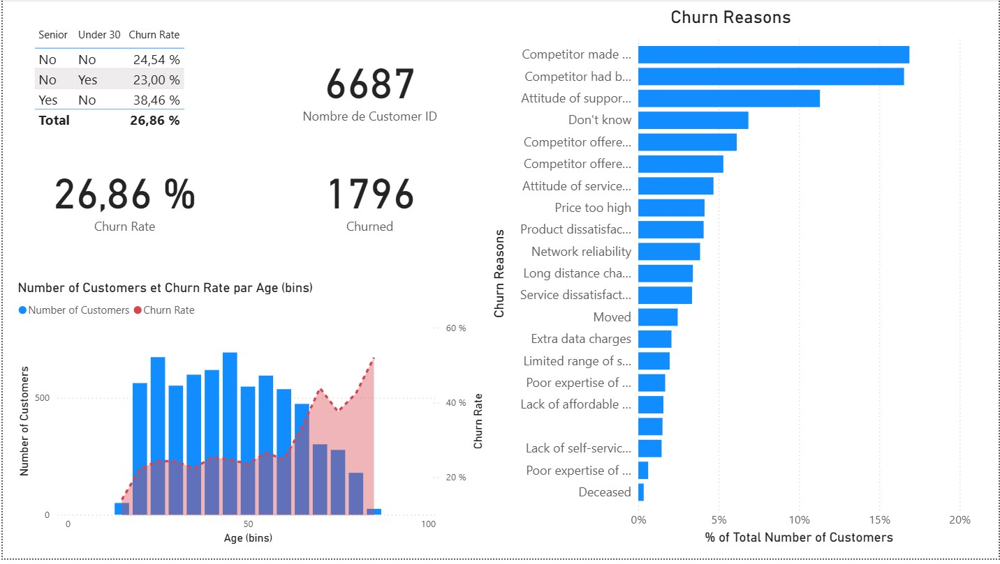

# 📊 Power BI Case Study – Customer Churn Analysis

## 🧠 Context

Subscription-based businesses like telecom companies rely on customer retention for long-term profitability. High churn rates directly impact revenue and growth potential. Understanding **why** customers are churning is more valuable than just knowing **how many** are leaving. Databel, a fictional telecom company, needs clear insights into its customer churn patterns to take effective action.

## ✅ Solution

This case study uses **Power BI** to:

- Import and model customer churn data using **Power Query Editor**
- Create meaningful **DAX measures** and **calculated columns** to analyze behavior and risk factors
- Build a series of **interactive dashboards** and **report pages** to visualize churn metrics
- Segment customer groups to uncover trends in churn by demographics, service usage, and contract types

## 📈 Result

- Delivered a professional Power BI report that identifies:
  - Key drivers of churn (e.g., contract type, customer tenure, payment method)
  - High-risk customer segments
  - Visual summaries of churn trends across multiple variables

- Empowered stakeholders with actionable insights to:
  - Improve customer retention strategies
  - Prioritize outreach to at-risk segments
  - Monitor churn rate in real-time

## 🛠 Tools & Technologies

- Power BI Desktop  
- DAX (Data Analysis Expressions)  
- Power Query Editor  
- Data Modeling  
- Visualization Design

## 📁 Dataset

The dataset is a synthetic telecom dataset by **Databel**, used for educational and demonstration purposes. It includes:

- Customer demographics  
- Subscription details  
- Usage metrics  
- Churn indicators

## 📎 How to Use

1. Download and open the `.pbix` file in Power BI Desktop  
2. Explore report pages and filters  
3. Review DAX measures and calculations  
4. Customize visuals or logic to fit new business scenarios

---

**Author**: Gael Mukendi Kabongo  
**LinkedIn**: [My LinkedIn]([https://linkedin.com/in/yourprofile](https://www.linkedin.com/in/gael-mukendi-kabongo/))  
**Email**: gmka98@gmail.com
